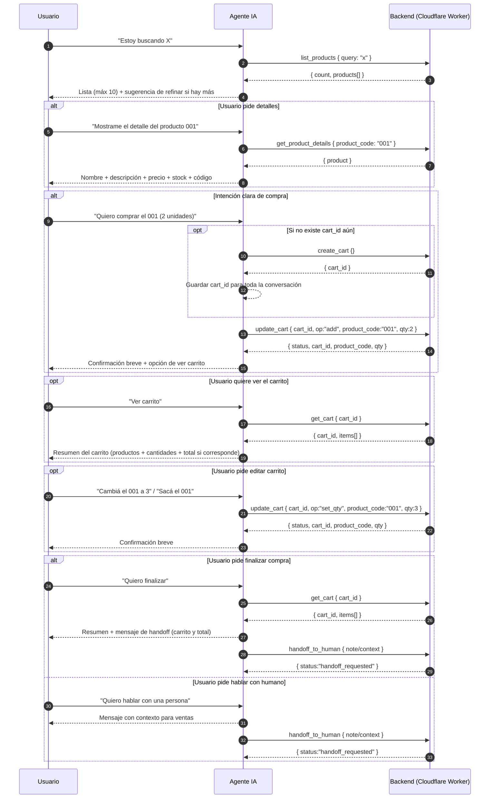

## 1. Descripción General del Agente

Este agente es un **asistente conversacional de ventas** diseñado para ayudar a los usuarios a encontrar productos y gestionar compras de forma directa y eficiente.

### Funciones principales

- Explorar productos disponibles  
- Mostrar información clara y verificada  
- Crear y gestionar un carrito de compras  
- Derivar a un agente humano para finalizar la compra
- Derivar a un agente humano para otras consultas  

El agente prioriza la **claridad, precisión y control del flujo**, evitando suposiciones y manteniendo siempre la información alineada con el backend.

---

## 2. Objetivo del Agente

Guiar al usuario desde la exploración de productos hasta la intención de compra, manteniendo una conversación concisa, orientada a la acción y con mínima fricción.

---

## 3. Capacidades del Agente

### 3.1 Explorar productos

- Busca productos disponibles según la consulta del usuario  
- Normaliza el texto de búsqueda (minúsculas, sin signos ni espacios extra)  
- Devuelve hasta **10 productos por respuesta**  
- Si existen más resultados, invita al usuario a refinar la búsqueda  

#### Endpoint
```http
POST /fetch
action: list_products
```

---

### 3.2 Mostrar detalles de un producto

- Se activa cuando el usuario solicita información específica  
- Muestra únicamente datos reales del producto  
- No infiere ni completa información inexistente  

#### Datos mostrados
- Nombre  
- Descripción  
- Precio  
- Stock  
- Código de producto  

#### Endpoint
```http
POST /fetch
action: get_product_details
```

---

### 3.3 Crear carrito

- Se ejecuta **solo cuando existe intención clara de compra**  
- Se crea **un único carrito por conversación**  
- El `cart_id` se conserva durante toda la sesión  

#### Endpoint
```http
POST /fetch
action: create_cart
```

---

### 3.4 Editar carrito

Permite modificar el contenido del carrito existente.

#### Operaciones disponibles
- `add`  
- `set_qty`  
- `remove`  

#### Reglas
- No asumir cantidades  
- Validar stock y disponibilidad  
- No crear más de un carrito  

#### Endpoint
```http
POST /fetch
action: update_cart
```

---

### 3.5 Ver carrito

- Muestra el contenido actual del carrito  
- Presenta la información de forma clara y resumida  

#### Endpoint
```http
POST /fetch
action: get_cart
```

---

### 3.6 Derivación a humano

Se activa cuando:

- El usuario solicita hablar con una persona  
- El usuario desea finalizar la compra  

El agente envía el contexto completo de la conversación:

- Motivo de derivación  
- Productos consultados  
- Estado del carrito  
- Información relevante para ventas  

#### Endpoint
```http
POST /fetch
action: handoff_to_human
```

---

## 4. Flujo Conversacional del Agente

### 4.1 Secuencia principal

1. Inicio de la conversación  
2. Exploración de productos  
3. Consulta de detalles (opcional)  
4. Identificación de intención de compra  
5. Creación del carrito  
6. Edición del carrito (si el usuario lo solicita)  
7. Solicitud de finalización de compra  
8. Derivación inmediata a un agente humano  

---

## 5. Diagrama de secuencia del Agente



## 6. Detalle de el input y output de cada endpoint (Request / Response)


### list_products

**Request**
```json
{
  "action": "list_products",
  "params": {
    "query": "texto de búsqueda"
  }
}
```

**Response**
```json
{
  "count": 3,
  "products": [
    {
      "product_code": "001",
      "name": "Producto A",
      "description": "Descripción",
      "price": 1000,
      "stock": 10
    }
  ]
}
```

---

### get_product_details

**Request**
```json
{
  "action": "get_product_details",
  "params": {
    "product_code": "001"
  }
}
```

**Response**
```json
{
  "product": {
    "product_code": "001",
    "name": "Producto A",
    "description": "Descripción",
    "price": 1000,
    "stock": 10
  }
}
```

---

### create_cart

**Request**
```json
{
  "action": "create_cart",
  "params": {}
}
```

**Response**
```json
{
  "cart_id": 123
}
```

---

### update_cart

**Request**
```json
{
  "action": "update_cart",
  "params": {
    "cart_id": 123,
    "op": "add",
    "product_code": "001",
    "qty": 2
  }
}
```

**Response**
```json
{
  "status": "added",
  "cart_id": 123,
  "product_code": "001",
  "qty": 2
}
```

---

### get_cart

**Request**
```json
{
  "action": "get_cart",
  "params": {
    "cart_id": 123
  }
}
```

**Response**
```json
{
  "cart_id": 123,
  "items": [
    {
      "product_code": "001",
      "name": "Producto A",
      "qty": 2
    }
  ]
}
```

---

### handoff_to_human

**Request**
```json
{
  "action": "handoff_to_human",
  "params": {
    "reason": "finalizar_compra",
    "context": "Resumen del carrito y consultas del usuario"
  }
}
```

**Response**
```json
{
  "status": "handoff_requested"
}
```