## 1. Descripción General del Agente

Este agente es un **asistente conversacional de ventas** diseñado para ayudar a los usuarios a encontrar productos y gestionar compras de forma directa y eficiente.

### Funciones principales

- Explorar productos disponibles  
- Mostrar información clara y verificada  
- Crear y gestionar un carrito de compras  
- Derivar a un agente humano para finalizar la compra  

El agente prioriza la **claridad, precisión y control del flujo**, evitando suposiciones y manteniendo siempre la información alineada con el backend.

---

## 2. Objetivo del Agente

Guiar al usuario desde la exploración de productos hasta la intención de compra, manteniendo una conversación concisa, orientada a la acción y con mínima fricción.

---

## 3. Capacidades del Agente

### 3.1 Explorar productos

- Busca productos disponibles según la consulta del usuario  
- Normaliza el texto de búsqueda (minúsculas, sin signos ni espacios extra)  
- Devuelve hasta **10 productos por respuesta**  
- Si existen más resultados, invita al usuario a refinar la búsqueda  

#### Endpoint
```http
POST /fetch
action: list_products
```

---

### 3.2 Mostrar detalles de un producto

- Se activa cuando el usuario solicita información específica  
- Muestra únicamente datos reales del producto  
- No infiere ni completa información inexistente  

#### Datos mostrados
- Nombre  
- Descripción  
- Precio  
- Stock  
- Código de producto  

#### Endpoint
```http
POST /fetch
action: get_product_details
```

---

### 3.3 Crear carrito

- Se ejecuta **solo cuando existe intención clara de compra**  
- Se crea **un único carrito por conversación**  
- El `cart_id` se conserva durante toda la sesión  

#### Endpoint
```http
POST /fetch
action: create_cart
```

---

### 3.4 Editar carrito

Permite modificar el contenido del carrito existente.

#### Operaciones disponibles
- `add`  
- `set_qty`  
- `remove`  

#### Reglas
- No asumir cantidades  
- Validar stock y disponibilidad  
- No crear más de un carrito  

#### Endpoint
```http
POST /fetch
action: update_cart
```

---

### 3.5 Ver carrito

- Muestra el contenido actual del carrito  
- Presenta la información de forma clara y resumida  

#### Endpoint
```http
POST /fetch
action: get_cart
```

---

### 3.6 Derivación a humano

Se activa cuando:

- El usuario solicita hablar con una persona  
- El usuario desea finalizar la compra  

El agente envía el contexto completo de la conversación:

- Motivo de derivación  
- Productos consultados  
- Estado del carrito  
- Información relevante para ventas  

#### Endpoint
```http
POST /fetch
action: handoff_to_human
```

---

## 4. Flujo Conversacional del Agente

### 4.1 Secuencia principal

1. Inicio de la conversación  
2. Exploración de productos  
3. Consulta de detalles (opcional)  
4. Identificación de intención de compra  
5. Creación del carrito  
6. Edición del carrito (si el usuario lo solicita)  
7. Solicitud de finalización de compra  
8. Derivación inmediata a un agente humano  

---

## 5. Diagrama de Flujo del Agente

```mermaid
flowchart TD
    A[Inicio de la conversación] --> B[Explorar productos]
    B -->|Resultados| C[Mostrar productos]
    C -->|Solicita detalle| D[Mostrar detalle del producto]
    C -->|Intención de compra| E[Crear carrito]
    D -->|Intención de compra| E
    E --> F[Carrito creado]
    F -->|Editar carrito| G[Actualizar carrito]
    G --> F
    F -->|Ver carrito| H[Mostrar carrito]
    H -->|Finalizar compra| I[Derivar a humano]
```



---

## 6. Reglas Clave del Diseño

- El agente **no inventa información**  
- No afirma acciones que no haya ejecutado  
- La búsqueda depende de cómo esté cargada la información  
- Si no hay resultados, informa y ofrece alternativas  
- Mantiene un flujo de compra controlado  
- Evita mensajes extensos o redundantes  
- Prioriza la derivación humana para pagos y logística  

---

## 7. Resultado Esperado

Un agente de ventas conversacional que:

- Reduce fricción en el proceso de compra  
- Evita errores de stock, precios o productos  
- Acompaña al usuario de forma clara y eficiente  
- Entrega al humano todo el contexto necesario para cerrar la venta  


# 🗺️ Mapa de Flujo · Agente de Ventas (Explorar → Carrito → Editar)

## 1) Diagrama de secuencia (recomendado)

```mermaid
sequenceDiagram
    autonumber
    participant U as Usuario
    participant A as Agente IA
    participant B as Backend (Cloudflare Worker)

    U->>A: "Estoy buscando X"
    A->>B: list_products { query: "x" }
    B-->>A: { count, products[] }
    A-->>U: Lista (máx 10) + sugerencia de refinar si hay más

    alt Usuario pide detalles
        U->>A: "Mostrame el detalle del producto 001"
        A->>B: get_product_details { product_code: "001" }
        B-->>A: { product }
        A-->>U: Nombre + descripción + precio + stock + código
    end

    alt Intención clara de compra
        U->>A: "Quiero comprar el 001 (2 unidades)"
        opt Si no existe cart_id aún
            A->>B: create_cart {}
            B-->>A: { cart_id }
            A-->>A: Guardar cart_id para toda la conversación
        end
        A->>B: update_cart { cart_id, op:"add", product_code:"001", qty:2 }
        B-->>A: { status, cart_id, product_code, qty }
        A-->>U: Confirmación breve + opción de ver carrito
    end

    opt Usuario quiere ver el carrito
        U->>A: "Ver carrito"
        A->>B: get_cart { cart_id }
        B-->>A: { cart_id, items[] }
        A-->>U: Resumen del carrito (productos + cantidades + total si corresponde)
    end

    opt Usuario pide editar carrito
        U->>A: "Cambiá el 001 a 3" / "Sacá el 001"
        A->>B: update_cart { cart_id, op:"set_qty", product_code:"001", qty:3 }
        B-->>A: { status, cart_id, product_code, qty }
        A-->>U: Confirmación breve
    end

    alt Usuario pide finalizar compra
        U->>A: "Quiero finalizar"
        A->>B: get_cart { cart_id }
        B-->>A: { cart_id, items[] }
        A-->>U: Resumen + mensaje de handoff (carrito y total)
        A->>B: handoff_to_human { note/context }
        B-->>A: { status:"handoff_requested" }
    else Usuario pide hablar con humano
        U->>A: "Quiero hablar con una persona"
        A-->>U: Mensaje con contexto para ventas
        A->>B: handoff_to_human { note/context }
        B-->>A: { status:"handoff_requested" }
    end
```



